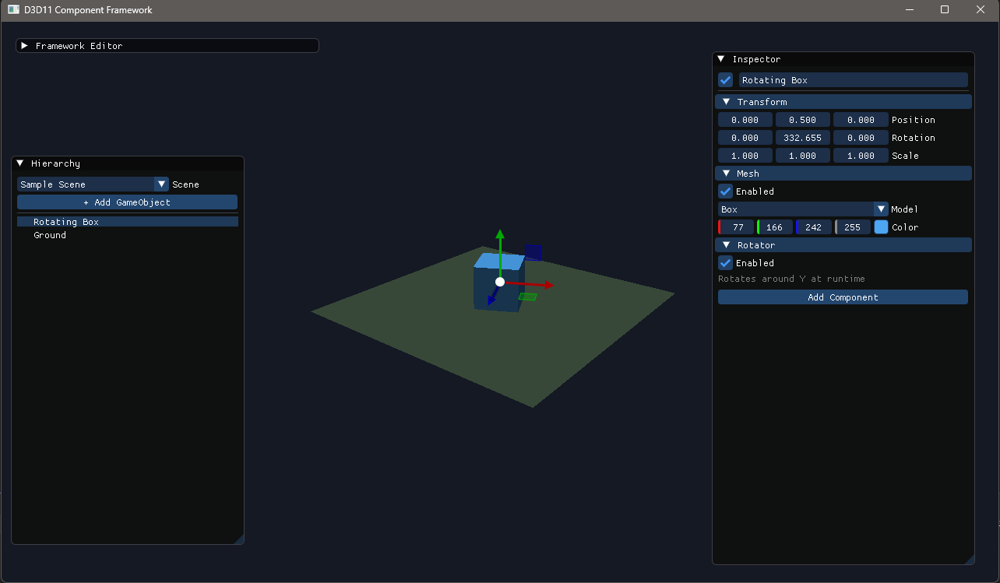
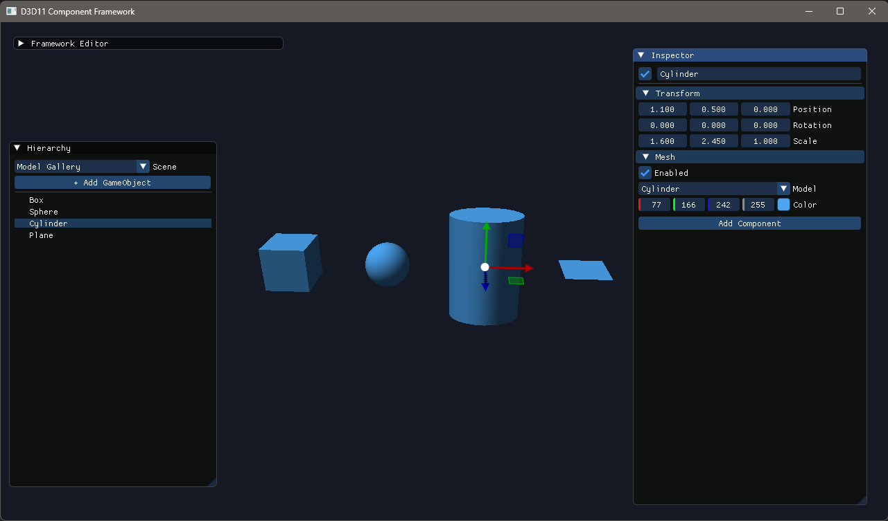

# 프롬프트

이 문서는 ChatGPT-5.6 Sol, 추론 단계 높음, Codex를 이용하여 작성했습니다.
프롬프트 사용 및 작업 내역은 [여기](Prompt.md)를 참고하세요.

# 미리보기 이미지





# D3D11 Component Framework

Visual Studio 2022와 C++20을 기준으로 만든 소형 Direct3D 11 프레임워크입니다. Win32 윈도우, Direct3D 초기화, Dear ImGui 편집기, Unity에서 착안한 Scene 및 Component 생명주기를 서로 분리했습니다.

## 빠른 시작

필요 환경은 Visual Studio 2022의 **Desktop development with C++** 워크로드와 CMake 3.24 이상입니다.

```powershell
cmake --preset vs2022
cmake --build --preset vs2022-debug
```

생성된 `Build/D3D11Framework.sln`을 Visual Studio 2022로 열어 `D3D11Framework`를 시작 프로젝트로 실행할 수도 있습니다. 최초 구성 시 CMake가 공식 Dear ImGui `v1.92.9`와 ImGuizmo `1.10` 소스를 내려받으므로 인터넷 연결이 필요합니다.

상세한 구조 및 확장 방법은 [한국어 가이드](Docs/FrameworkGuide.ko.md)를 참고하십시오.

## 주요 구성

- `Window`: Win32 클래스 등록, 창 생성, 메시지 펌프, 크기 변경 이벤트
- `D3D11Renderer`: D3D11 Device/Context, DXGI SwapChain, Color/Depth Target
- `SceneRenderer`: 기본 카메라, 셰이더와 Primitive Mesh 렌더 패스
- `EditorLayer`: Scene 전환, Hierarchy, ImGuizmo 기반 Transform Gizmo, Inspector UI
- `EditorCamera`: Component와 분리된 편집 전용 자유 시점 카메라
- `SceneManager`, `Scene`, `GameObject`, `Component`: 다중 Scene과 Unity식 생명주기
- `TransformComponent`: 모든 GameObject가 자동으로 갖는 필수 Component
- `MeshComponent`: Box, Sphere, Cylinder, Plane 모델과 색상
- `RotatorComponent`: 사용자 Component 작성 예시

Dear ImGui와 ImGuizmo는 MIT License이며 CMake 구성 시 공식 저장소에서 받아 정적으로 링크합니다.

## Editor 카메라 조작

ImGui 창이 아닌 장면 영역에서 조작합니다.

- 마우스 오른쪽 버튼을 누른 상태로 `W`, `A`, `S`, `D`: 전후좌우 이동
- 마우스 오른쪽 버튼을 누른 상태로 드래그: 시점 회전
- 마우스 휠: 바라보는 방향으로 확대/축소
- `Left Shift`: 이동 속도 증가

## Transform Gizmo 조작

Hierarchy에서 GameObject를 선택하면 해당 Transform의 로컬 X/Y/Z축에 맞춘 Gizmo가 표시됩니다.

- `W`: 이동 Gizmo
- `E`: 회전 Gizmo
- `R`: 크기 Gizmo
- 축 또는 평면 핸들을 마우스 왼쪽 버튼으로 드래그: 선택한 축 기준 Transform 변경

우클릭 카메라 탐색 중에는 `W`가 카메라 전진으로 사용되며 Gizmo 모드는 바뀌지 않습니다.